# Aadhaar KYC Face Matching Pipeline - Architecture

## System Overview

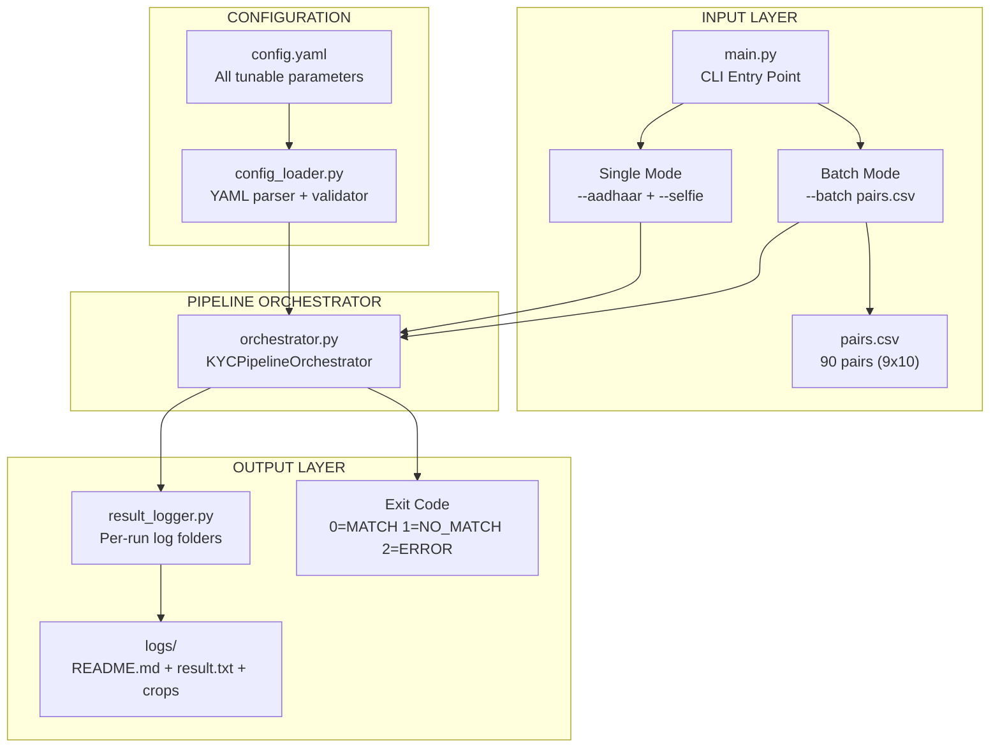

## Complete Pipeline Flow

```mermaid
flowchart TD
    START(["Start: run(aadhaar_bytes, selfie_bytes)"])

    subgraph STAGE1["STAGE 1: Image Loading"]
        S1A["bytes_to_bgr(aadhaar_bytes)<br/>EXIF correction + PDF extraction"]
        S1B["bytes_to_bgr(selfie_bytes)<br/>EXIF correction"]
        PDF{"PDF detected?<br/>%PDF- magic bytes"}
        PDFEX["PyMuPDF: extract<br/>embedded image or<br/>render page at 2x"]
        JPG["OpenCV: imdecode<br/>BGR numpy array"]
    end

    subgraph STAGE2["STAGE 2: Quality Assessment & Enhancement"]
        QA["quality_score(image)<br/>Laplacian variance"]
        QCHECK{"quality < 0.4?"}
        ESRGAN["Real-ESRGAN<br/>2x upscale<br/>(tile=512, GPU)"]
        SKIP["Skip enhancement<br/>(already sharp)"]
        S2OUT["enhanced_img + quality_score"]
    end

    subgraph STAGE2B["STAGE 2b: Preprocessing (Optional)"]
        CLAHE{"CLAHE enabled?<br/>(Aadhaar only)"}
        CAPP["apply_clahe()<br/>LAB L-channel<br/>clip=2.0, tile=8"]
        GRAY{"Grayscale<br/>normalize?"}
        GAPP["to_grayscale_bgr()<br/>Remove color domain gap"]
    end

    subgraph STAGE3["STAGE 3: Face Detection + Embedding"]
        CACHE{"Embedding<br/>cache hit?<br/>SHA-256 lookup"}
        CHIT["Cache HIT<br/>Return stored FaceResult"]
        
        DET["RetinaFace detect<br/>det_size=640x640<br/>det_thresh=0.7"]
        NOFACE{"Faces<br/>found?"}
        FALLBACK["Retry detection<br/>det_thresh=0.5"]
        NOFACE2{"Faces<br/>found?"}
        ERROR1["NoFaceDetectedError"]
        
        BEST["Select best face<br/>argmax(det_score)"]
        ALIGN["5-point landmark<br/>alignment -> 112x112 crop"]
        EMBED["ArcFace R50<br/>512-d embedding<br/>L2-normalized"]
        
        TTA{"TTA mode?"}
        FLIP["Flip augment<br/>avg(orig, flipped)"]
        ENSEMBLE["Ensemble augment<br/>avg(orig, flip,<br/>bright, dark, blur)"]
        NOTTA["Single embedding"]
        
        DEMO["Gender + Age<br/>estimation"]
        LMK["68-point 3D landmarks<br/>+ pose (pitch/yaw/roll)"]
        
        CSTORE["Cache MISS<br/>Store FaceResult"]
    end

    subgraph STAGE3B["STAGE 3b: Crop Restoration (Optional)"]
        CROP{"Crop restore<br/>enabled?"}
        BILATERAL["Bilateral filter<br/>d=5, sigma=50"]
        GFPGAN["GFPGAN restore<br/>(if model available)"]
    end

    subgraph STAGE4["STAGE 4: Similarity Scoring"]
        COS["Cosine similarity<br/>dot(emb_a, emb_s)"]
        
        DUAL{"Dual-path<br/>enabled?"}
        ORIG["Process original<br/>(unenhanced) Aadhaar"]
        COMPARE{"Original score<br/>> enhanced?"}
        USEORIGINAL["Use original path"]
        USEENHANCED["Use enhanced path"]
    end

    subgraph STAGE4C["STAGE 4c: AdaFace Fusion (Optional)"]
        ADA{"AdaFace<br/>available?"}
        ADAEMB["AdaFace IR-101<br/>512-d embeddings"]
        ADAFUSE["Fused score<br/>0.7*ArcFace + 0.3*AdaFace"]
    end

    subgraph STAGE4D["STAGE 4d: S-Norm Calibration (Optional)"]
        SNORM{"S-norm<br/>available?"}
        ZNORM["Z-score normalize<br/>against impostor cohort"]
    end

    subgraph STAGE4E["STAGE 4e: Multi-Metric Computation"]
        L2["L2 distance<br/>l2_score = e^(-1.5*dist)"]
        SSIM["SSIM<br/>Structural similarity<br/>on 112x112 crops"]
        LMKSCORE["Landmark geometry<br/>12 age-invariant ratios<br/>e^(-20*avg_diff)"]
        POSE["Pose difference<br/>pitch/yaw/roll delta"]
        FUSED["Fused score<br/>55% cos + 25% lmk<br/>+ 10% L2 + 10% SSIM"]
    end

    subgraph STAGE5["STAGE 5: Decision & VLM Gate"]
        DECIDE{"Cosine score<br/>threshold check"}
        MATCH_ZONE["MATCH ZONE<br/>score >= 0.60"]
        UNCERTAIN_ZONE["UNCERTAIN ZONE<br/>0.40 <= score < 0.60"]
        NOMATCH_ZONE["NO MATCH ZONE<br/>score < 0.40"]

        QLOW1{"Quality low?"}
        VLM_YES["Invoke VLM guard"]
        VLM_NO["Skip VLM"]

        AGEGAP{"Age gap > 5yr?"}
        RELAX["Relax thresholds<br/>-0.01/yr (max -0.10)"]

        subgraph VLM["VLM Guard (Ollama)"]
            VLMCALL["HTTP POST to Ollama<br/>Qwen2.5-VL-7B"]
            VLMPROMPT["Prompt: Compare bone<br/>structure, ignore aging<br/>+ age-conditioned guidance"]
            VLMPARSE["Parse JSON response<br/>(fallback: regex)"]
            VLMOUT["VLMVerdict<br/>same_person + confidence<br/>+ reasoning"]
        end
    end

    subgraph STAGE6["STAGE 6: Final Decision Fusion"]
        FUSE["_fuse_decision()"]

        subgraph HIGHSCORE["Score >= Match Threshold"]
            HS_VLM{"VLM says<br/>same person?"}
            HS_YES["MATCH<br/>conf += 8 (VLM bonus)"]
            HS_NO["NO MATCH<br/>conf -= 20 (VLM override)"]
            HS_NONE["MATCH<br/>(no VLM available)"]
        end

        subgraph MIDSCORE["Uncertain Zone"]
            MS_VLM{"VLM says<br/>same person?"}
            MS_YES["MATCH<br/>conf += 8 (VLM confirms)"]
            MS_NO["NO MATCH<br/>conf -= 10 (VLM rejects)"]
            MS_NONE["NO MATCH<br/>(no VLM to confirm)"]
        end

        LOWSCORE["NO MATCH<br/>score too low"]

        AGEADJUST{"Age gap > 5yr<br/>AND VLM confirms?"}
        AGEBONUS["conf += 5<br/>age gap VLM bonus"]
        QPENALTY{"Quality low?"}
        QPEN["conf -= 5"]
        GCHECK{"Gender<br/>mismatch?"}
        GPEN["conf -= penalty"]
        CLAMP["Clamp confidence<br/>to 0.0 - 99.0"]
    end

    subgraph STAGE6B["STAGE 6b: Confidence Calibration (Optional)"]
        CAL{"Calibration<br/>enabled?"}
        PLATT["Platt scaling<br/>P = 1/(1+exp(-(15s-7.5)))<br/>score -> probability %"]
    end

    subgraph STAGE7["STAGE 7: Logging"]
        LOG["result_logger.py"]
        LOGFILES["Log folder:<br/>result.txt + README.md<br/>+ face crops + metrics"]
        BATCHLOG["Batch: summary.txt<br/>+ README.md table"]
    end

    RESULT(["PipelineResult<br/>match + confidence + metrics"])

    %% Flow connections
    START --> S1A & S1B
    S1A --> PDF
    PDF -->|Yes| PDFEX --> QA
    PDF -->|No| JPG --> QA
    S1B --> JPG

    QA --> QCHECK
    QCHECK -->|Yes| ESRGAN --> S2OUT
    QCHECK -->|No| SKIP --> S2OUT

    S2OUT --> CLAHE
    CLAHE -->|Yes| CAPP --> GRAY
    CLAHE -->|No| GRAY
    GRAY -->|Yes| GAPP --> CACHE
    GRAY -->|No| CACHE

    CACHE -->|Hit| CHIT --> COS
    CACHE -->|Miss| DET
    DET --> NOFACE
    NOFACE -->|Yes| BEST
    NOFACE -->|No| FALLBACK --> NOFACE2
    NOFACE2 -->|Yes| BEST
    NOFACE2 -->|No| ERROR1

    BEST --> ALIGN --> EMBED --> TTA
    TTA -->|Flip| FLIP --> DEMO
    TTA -->|Ensemble| ENSEMBLE --> DEMO
    TTA -->|None| NOTTA --> DEMO
    DEMO --> LMK --> CSTORE --> CROP

    CROP -->|Yes| BILATERAL --> COS
    CROP -->|No| COS

    COS --> DUAL
    DUAL -->|Yes| ORIG --> COMPARE
    COMPARE -->|Yes| USEORIGINAL --> ADA
    COMPARE -->|No| USEENHANCED --> ADA
    DUAL -->|No| ADA

    ADA -->|Yes| ADAEMB --> ADAFUSE --> SNORM
    ADA -->|No| SNORM

    SNORM -->|Yes| ZNORM --> L2
    SNORM -->|No| L2

    L2 --> SSIM --> LMKSCORE --> POSE --> FUSED

    FUSED --> DECIDE
    DECIDE -->|">= 0.60"| MATCH_ZONE --> QLOW1
    DECIDE -->|"0.40 - 0.60"| UNCERTAIN_ZONE --> VLM_YES
    DECIDE -->|"< 0.40"| NOMATCH_ZONE --> LOWSCORE

    QLOW1 -->|Yes| VLM_YES
    QLOW1 -->|No| VLM_NO

    MATCH_ZONE --> AGEGAP
    UNCERTAIN_ZONE --> AGEGAP
    AGEGAP -->|Yes| RELAX
    AGEGAP -->|No| FUSE

    VLM_YES --> VLMCALL --> VLMPROMPT --> VLMPARSE --> VLMOUT --> FUSE
    VLM_NO --> FUSE
    RELAX --> FUSE

    FUSE --> HIGHSCORE & MIDSCORE & LOWSCORE
    HS_VLM -->|Yes| HS_YES
    HS_VLM -->|No| HS_NO
    HS_VLM -->|None| HS_NONE
    MS_VLM -->|Yes| MS_YES
    MS_VLM -->|No| MS_NO
    MS_VLM -->|None| MS_NONE

    HS_YES & HS_NO & HS_NONE & MS_YES & MS_NO & MS_NONE & LOWSCORE --> AGEADJUST
    AGEADJUST -->|Yes| AGEBONUS --> QPENALTY
    AGEADJUST -->|No| QPENALTY
    QPENALTY -->|Yes| QPEN --> GCHECK
    QPENALTY -->|No| GCHECK
    GCHECK -->|Yes| GPEN --> CLAMP
    GCHECK -->|No| CLAMP

    CLAMP --> CAL
    CAL -->|Yes| PLATT --> LOG
    CAL -->|No| LOG

    LOG --> LOGFILES & BATCHLOG
    LOGFILES --> RESULT
    BATCHLOG --> RESULT
```

## Module Dependency Map

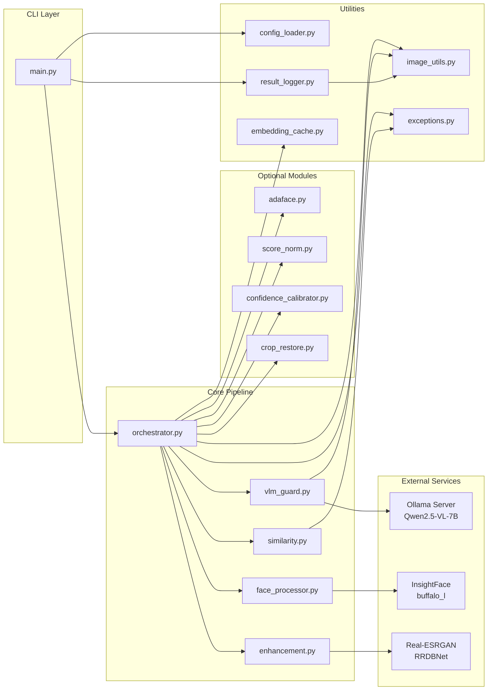

## Decision Tree: Match / No Match

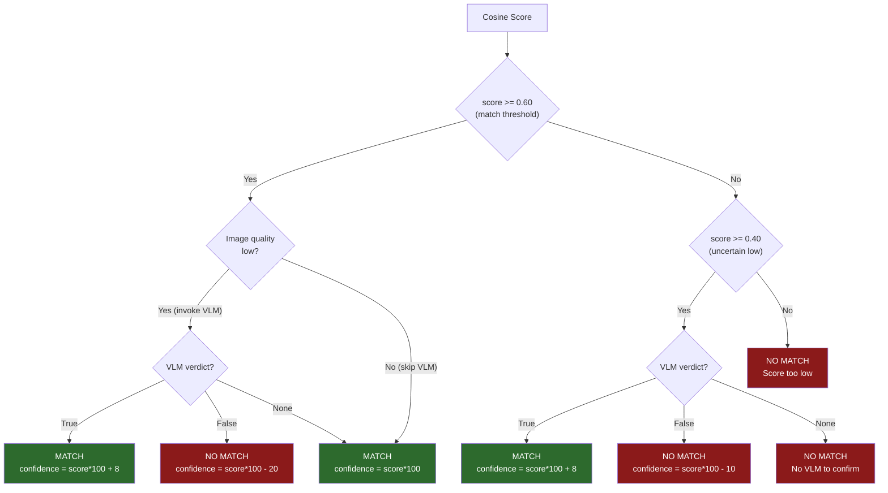

## Multi-Metric Fusion Weights

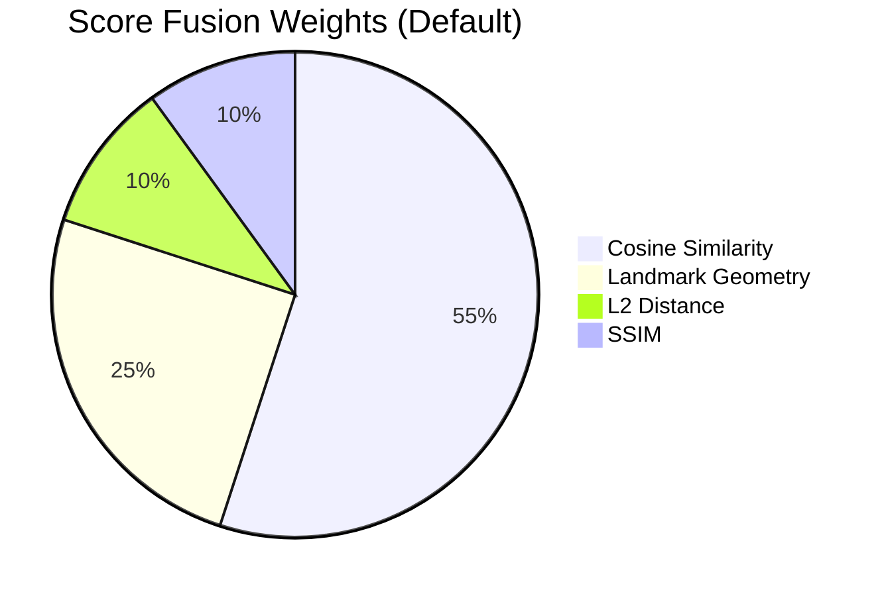

## Quality-Adaptive Weight Shift

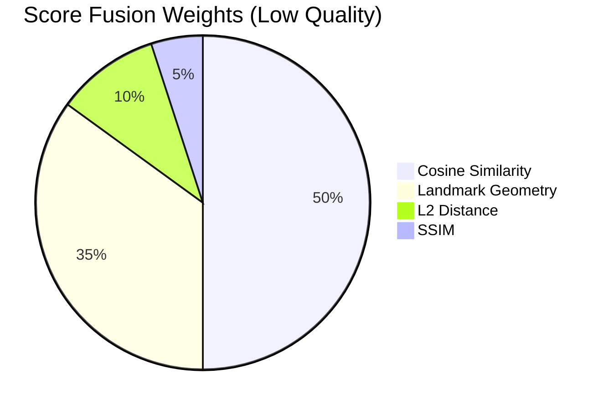

## Embedding Pipeline Detail

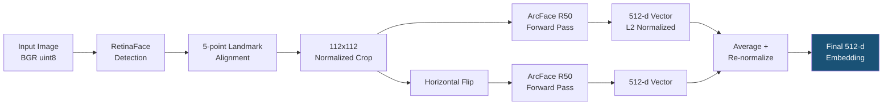

## Batch Processing Flow

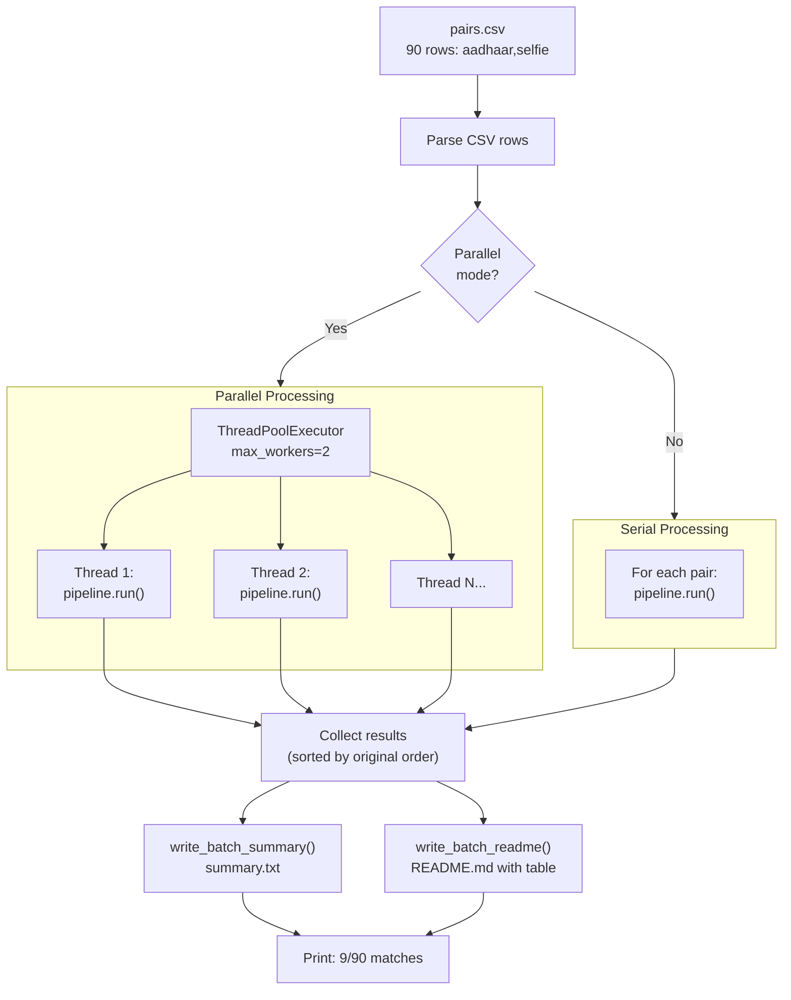

## Cache Strategy

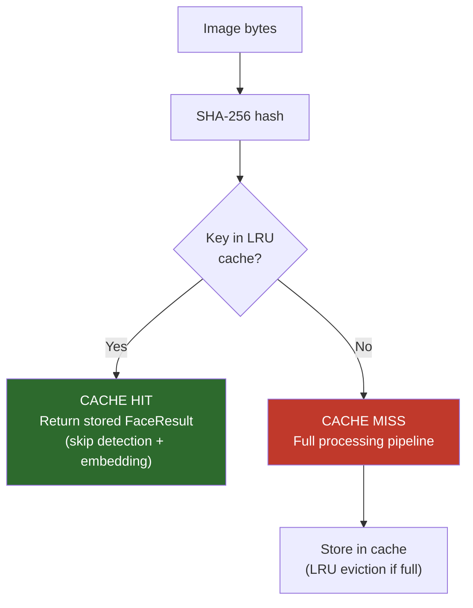

## Age Gap Threshold Relaxation

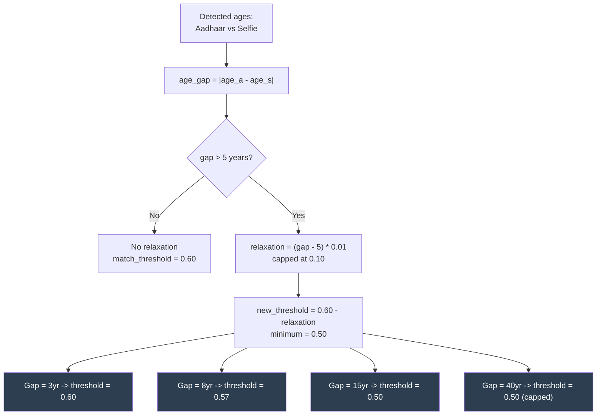

## Configuration Sections

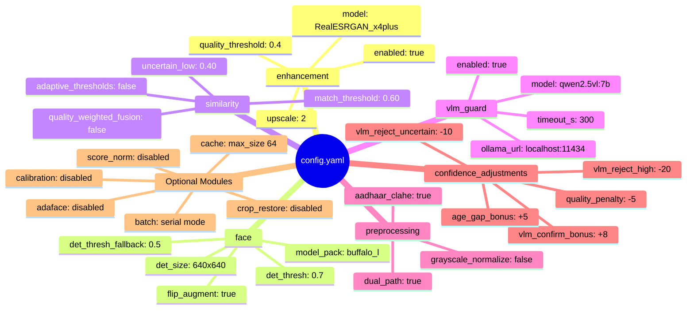

## File Map

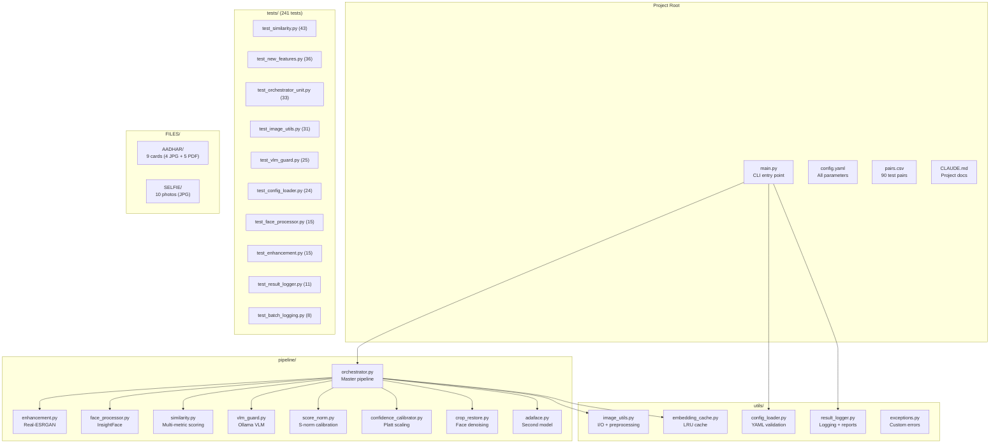
