# Aadhaar KYC Face Matching Pipeline

<p align="center">
  
</p>

> **End-to-end local face verification** for KYC (Know Your Customer) — compares a face in an Aadhaar identity card against a user selfie using deep learning + vision LLM reasoning. Runs entirely on-device with GPU acceleration.

---

## Problem Statement

| Input | Details |
|-------|---------|
| **Aadhaar Card Image** | ~300-400 KB, low quality, printed passport-style photo |
| **User Selfie** | ~80 KB, low quality, camera photo |
| **Goal** | Determine if both images show the **same person** |
| **Output** | `MATCH` / `NO MATCH` + confidence percentage |

**Challenges:** Low resolution, compression artifacts, lighting differences, age gap between Aadhaar photo and selfie, printed vs live face quality mismatch.

---

## Pipeline Architecture

```
Aadhaar Image ─┐                              ┌─ User Selfie
               │                              │
               ▼                              ▼
        ┌──────────────────────────────────────────┐
        │     STAGE 1: Quality Assessment           │
        │     Laplacian variance → quality [0-1]    │
        │     quality < 0.4 → enhance               │
        └──────────────────────────────────────────┘
               │                              │
               ▼                              ▼
        ┌──────────────────────────────────────────┐
        │     STAGE 2: Image Enhancement            │
        │     Real-ESRGAN 2x upscale (FP16 GPU)    │
        │     Preserves facial structure             │
        └──────────────────────────────────────────┘
               │                              │
               ▼                              ▼
        ┌──────────────────────────────────────────┐
        │     STAGE 3: Face Detection + Alignment   │
        │     InsightFace buffalo_l (RetinaFace)    │
        │     5-point landmarks → 112×112 crop      │
        └──────────────────────────────────────────┘
               │                              │
               ▼                              ▼
        ┌──────────────────────────────────────────┐
        │     STAGE 4: Face Embedding               │
        │     ArcFace R50 → 512-d L2-normalized     │
        └──────────────────────────────────────────┘
               │                              │
               └──────────┬───────────────────┘
                          ▼
        ┌──────────────────────────────────────────┐
        │     STAGE 5: Cosine Similarity            │
        │     score = dot(emb_A, emb_B)             │
        │                                           │
        │     < 0.40  →  NO MATCH                   │
        │     0.40-0.60  →  UNCERTAIN → VLM Guard   │
        │     ≥ 0.60  →  MATCH                      │
        └──────────────────────────────────────────┘
                          │
                          ▼ (if uncertain)
        ┌──────────────────────────────────────────┐
        │     STAGE 6: Vision LLM Guard             │
        │     Qwen2.5-VL-7B via Ollama              │
        │     Structural face comparison             │
        │     JSON verdict + reasoning               │
        └──────────────────────────────────────────┘
                          │
                          ▼
        ┌──────────────────────────────────────────┐
        │     OUTPUT: MATCH / NO MATCH              │
        │     Confidence: 84.2%                     │
        │     Cosine: 0.6821                        │
        │     VLM: "Eye spacing and nose bridge..." │
        └──────────────────────────────────────────┘
```

---

## Technology Stack

| Component | Technology | Version | Purpose |
|-----------|-----------|---------|---------|
| **Image Enhancement** | Real-ESRGAN | 0.3.0 | 2x super-resolution, preserves facial structure |
| **Face Detection** | RetinaFace (InsightFace) | 0.7.3 | Face localization with 5-point landmarks |
| **Face Alignment** | InsightFace buffalo_l | 0.7.3 | Affine warp to canonical 112x112 crop |
| **Face Embedding** | ArcFace R50 | WebFace600K | 512-d L2-normalized feature vector |
| **Similarity** | NumPy cosine dot | 1.26.4 | Threshold-based match/uncertain/no-match |
| **Vision LLM Guard** | Qwen2.5-VL-7B | via Ollama | Structural face comparison with reasoning |
| **ONNX Inference** | ONNX Runtime GPU | 1.19.2 | CUDA-accelerated face model inference |
| **Deep Learning** | PyTorch | 2.3.1+cu121 | GPU backend for Real-ESRGAN |

### Why These Choices?

- **Real-ESRGAN over GFPGAN** — GFPGAN over-restores faces causing identity drift. Real-ESRGAN preserves facial bone structure better for downstream matching (2024 research).
- **InsightFace buffalo_l** — All-in-one: detection + alignment + embedding in a single model pack. 450 FPS on RTX GPUs, 99.83% accuracy on LFW benchmark.
- **Qwen2.5-VL over LLaVA** — FaceXBench 2025 shows Qwen2.5-VL outperforms both LLaVA and GPT-4o on face verification tasks. Windows-native via Ollama (vLLM has no Windows support).
- **Cosine threshold 0.60** — Calibrated on 60,000-face database (InsightFace community research). Uncertain zone 0.40-0.60 routes to VLM for human-interpretable reasoning.

---

## Quick Start

### Prerequisites

- **GPU**: NVIDIA GPU with 8+ GB VRAM (tested on RTX 4080 Laptop 12GB)
- **OS**: Windows 10/11 or Linux
- **CUDA**: 12.x with cuDNN 9.x
- **Conda**: Miniconda or Anaconda

### 1. Clone and Setup

```bash
git clone https://github.com/MlvPrasadOfficial/GENAI_AADHAR.git
cd GENAI_AADHAR
```

### 2. Create Conda Environment

```bash
conda create -n aadhar python=3.11 -y
conda activate aadhar
```

### 3. Install Dependencies

```bash
# PyTorch with CUDA 12.1 (install FIRST)
pip install torch==2.3.1+cu121 torchvision==0.18.1+cu121 --extra-index-url https://download.pytorch.org/whl/cu121

# Core ML packages (ORDER MATTERS)
pip install numpy==1.26.4
pip install onnxruntime-gpu==1.19.2
pip install basicsr==1.4.2
pip install realesrgan==0.3.0
pip install insightface==0.7.3
pip install opencv-python==4.10.0.84 Pillow>=10.4.0
pip install PyYAML==6.0.2 requests>=2.32.3 tqdm>=4.66.4 pytest>=8.3.2
```

> **Windows Note:** InsightFace may require patching the Cython extension on Windows without MSVC Build Tools. See [CLAUDE.md](CLAUDE.md) for details.

### 4. Download Model Weights

```bash
python scripts/download_models.py
```

This downloads:
- **Real-ESRGAN x4plus** (~67 MB) — image enhancement
- **InsightFace buffalo_l** (~282 MB) — face detection + embedding

### 5. Install Ollama + Vision LLM (Optional)

```bash
# Windows
winget install Ollama.Ollama

# Or download from https://ollama.com

# Pull the vision model
ollama pull qwen2.5vl:7b
```

> The pipeline works **without Ollama** — it uses cosine similarity only. The VLM guard adds human-readable reasoning for uncertain cases.

### 6. Run

```bash
python main.py --aadhaar path/to/aadhaar_card.jpg --selfie path/to/selfie.jpg
```

---

## Usage

### Basic Match

```bash
python main.py --aadhaar aadhaar.jpg --selfie selfie.jpg
```

**Output:**
```
============================================
  Result:     MATCH
  Confidence: 84.2%
  Cosine:     0.6821
  VLM:        Matching eye socket depth and nose bridge width consistent across both images.
============================================
```

### Verbose Mode

```bash
python main.py --aadhaar aadhaar.jpg --selfie selfie.jpg --verbose
```

```
============================================
  Result:     MATCH
  Confidence: 84.2%
  Cosine:     0.6821
  VLM:        Matching eye socket depth and nose bridge width consistent.

  Aadhaar quality: 0.32
  Selfie quality:  0.71

  Timings (total 847ms):
    load_ms: 45ms
    enhancement_ms: 382ms
    face_processing_ms: 112ms
    similarity_ms: 0ms
============================================
```

### JSON Output (for programmatic use)

```bash
python main.py --aadhaar aadhaar.jpg --selfie selfie.jpg --json-output
```

```json
{
  "match": true,
  "confidence_pct": 84.2,
  "cosine_score": 0.6821,
  "vlm_same_person": true,
  "vlm_reasoning": "Matching eye socket depth and nose bridge width.",
  "stage_timings": {
    "load_ms": 45.2,
    "enhancement_ms": 382.1,
    "face_processing_ms": 112.4,
    "similarity_ms": 0.3
  },
  "aadhaar_quality": 0.32,
  "selfie_quality": 0.71,
  "error": null
}
```

### Debug Logging

```bash
python main.py --aadhaar aadhaar.jpg --selfie selfie.jpg --verbose --debug
```

### Exit Codes

| Code | Meaning |
|------|---------|
| `0` | MATCH |
| `1` | NO MATCH |
| `2` | ERROR (missing file, no face detected, config error) |

---

## Project Structure

```
GENAI_AADHAR/
├── main.py                          # CLI entry point
├── config.yaml                      # All tunable thresholds and model paths
├── requirements.txt                 # Pinned Python dependencies
├── CLAUDE.md                        # Developer guide for Claude Code sessions
├── PROJECT_ARCHITECTURE.md          # Detailed ASCII pipeline diagram
│
├── pipeline/                        # Core pipeline modules
│   ├── orchestrator.py              # Wires all stages → PipelineResult
│   ├── enhancement.py               # Real-ESRGAN + Laplacian quality scoring
│   ├── face_processor.py            # InsightFace: detect → align → embed
│   ├── similarity.py                # Cosine similarity + threshold decision
│   └── vlm_guard.py                 # Ollama Qwen2.5-VL HTTP client
│
├── utils/                           # Shared utilities
│   ├── exceptions.py                # NoFaceDetectedError, EnhancementError
│   ├── image_utils.py               # EXIF correction, BGR/base64 conversion
│   └── config_loader.py             # YAML config loader + validation
│
├── scripts/
│   └── download_models.py           # Downloads Real-ESRGAN + InsightFace weights
│
├── tests/                           # Test suite (23 tests)
│   ├── conftest.py                  # Shared fixtures
│   ├── test_similarity.py           # 14 cosine + threshold tests
│   ├── test_vlm_guard.py            # 9 VLM parsing + HTTP mock tests
│   └── test_pipeline.py             # Integration tests (requires models)
│
└── models/                          # Downloaded weights (gitignored)
    ├── realesrgan/RealESRGAN_x4plus.pth
    └── insightface/models/buffalo_l/*.onnx
```

---

## Configuration

All thresholds are in [`config.yaml`](config.yaml):

```yaml
enhancement:
  enabled: true
  quality_threshold: 0.4   # skip enhancement if image quality >= this

face:
  det_thresh: 0.7          # primary RetinaFace detection confidence
  det_thresh_fallback: 0.5 # retry with lower threshold if no face found

similarity:
  match_threshold: 0.60    # cosine >= 0.60 = definite MATCH
  uncertain_low: 0.40      # cosine < 0.40 = definite NO MATCH
                            # 0.40-0.60 = uncertain → invoke VLM guard

vlm_guard:
  enabled: true
  model: "qwen2.5vl:7b"    # best face verification accuracy (FaceXBench 2025)
  timeout_s: 30
```

### Decision Logic

```
Cosine Score        Quality OK?     VLM Available?    →  Decision
─────────────────────────────────────────────────────────────────
≥ 0.60              Yes             (skipped)         →  MATCH
≥ 0.60              No              Yes → agrees      →  MATCH
≥ 0.60              No              Yes → disagrees   →  NO MATCH
≥ 0.60              No              No                →  MATCH (trust score)
0.40–0.59           -               Yes → agrees      →  MATCH
0.40–0.59           -               Yes → disagrees   →  NO MATCH
0.40–0.59           -               No                →  NO MATCH (conservative)
< 0.40              -               (skipped)         →  NO MATCH
```

---

## How It Works (Deep Dive)

### Stage 1: Quality Assessment
Computes **Laplacian variance** on the grayscale image — a sharpness proxy. Images below the threshold (default 0.4) are sent through Real-ESRGAN for enhancement. This avoids wasting GPU cycles on already-clear images.

### Stage 2: Real-ESRGAN Enhancement
Uses **RRDBNet architecture** with 4x trained weights, applied at 2x upscale. Runs in **FP16** on GPU for speed. Unlike GFPGAN, Real-ESRGAN does not hallucinate facial features — it preserves the original bone structure while reducing noise and compression artifacts.

### Stage 3: Face Detection + Alignment
**RetinaFace-10GF** (part of InsightFace buffalo_l) detects faces with bounding boxes and 5-point landmarks (eyes, nose, mouth corners). An affine transform warps the face to a canonical 112x112 aligned crop. For Aadhaar cards, picks the face with highest detection confidence (ignoring QR codes, logos).

### Stage 4: ArcFace Embedding
**ArcFace R50** trained on WebFace600K produces a 512-dimensional L2-normalized embedding vector. This captures facial identity in a compact representation where cosine similarity directly measures face similarity.

### Stage 5: Cosine Similarity
Simple dot product of two L2-normalized vectors. The 3-zone threshold system provides:
- **High confidence** (≥0.60): Direct match without LLM overhead
- **Uncertain zone** (0.40-0.60): Escalate to VLM for reasoning
- **Clear rejection** (<0.40): Immediate no-match

### Stage 6: Vision LLM Guard
**Qwen2.5-VL-7B** via Ollama receives both aligned face crops and the cosine score. It compares structural facial features (eye spacing, nose bridge, jawline) while ignoring quality/lighting/age differences. Returns a JSON verdict with human-readable reasoning.

---

## Performance

Tested on **NVIDIA RTX 4080 Laptop GPU (12GB VRAM)**:

| Stage | Time |
|-------|------|
| Image loading + EXIF | ~5 ms |
| Real-ESRGAN (2x, FP16) | 200–400 ms |
| Face detection + alignment | 50–100 ms |
| ArcFace embedding | 20–50 ms |
| Cosine similarity | < 1 ms |
| Qwen2.5-VL via Ollama | 3–8 sec |
| **Total (no VLM)** | **~0.3–0.6 sec** |
| **Total (with VLM)** | **~4–9 sec** |

> The VLM is only invoked for uncertain cases (~20% of comparisons), so most matches complete in under 1 second.

---

## Testing

```bash
# Unit tests (no GPU, no Ollama needed — runs in 0.2s)
pytest tests/test_similarity.py tests/test_vlm_guard.py -v

# All non-integration tests
pytest tests/ -v -m "not integration"

# Full integration tests (requires downloaded models + GPU)
pytest tests/test_pipeline.py -v -m integration
```

**Current status: 23/23 tests passing**

---

## Verify GPU Setup

```python
# Check CUDA availability
import torch
print(torch.cuda.get_device_name(0))  # → NVIDIA GeForce RTX 4080 Laptop GPU

# Check ONNX Runtime GPU
import onnxruntime
print(onnxruntime.get_available_providers())
# → ['TensorrtExecutionProvider', 'CUDAExecutionProvider', 'CPUExecutionProvider']
```

---

## Troubleshooting

| Issue | Fix |
|-------|-----|
| `onnxruntime` not using GPU | `pip uninstall onnxruntime && pip install onnxruntime-gpu==1.19.2` |
| InsightFace `mesh_core_cython` error | Patch `insightface/app/__init__.py` — see [CLAUDE.md](CLAUDE.md) |
| `numpy 2.x` compatibility error | `pip install "numpy==1.26.4" --force-reinstall` |
| `functional_tensor` import error | Patch `basicsr/data/degradations.py` — see [CLAUDE.md](CLAUDE.md) |
| Aadhaar image sideways | Handled automatically via EXIF orientation correction |
| Ollama not responding | Run `ollama serve` or check if it's running in system tray |
| No face detected | Try a clearer image; pipeline retries at lower threshold (0.5) |

---

## Roadmap

- [ ] Batch processing mode (directory of image pairs)
- [ ] Anti-spoofing detection (printed photo vs live face)
- [ ] Aadhaar card OCR (extract name, number for cross-verification)
- [ ] Web API endpoint (FastAPI) for integration
- [ ] Docker container for deployment
- [ ] Threshold auto-calibration from labeled dataset

---

## Research References

- **ArcFace**: Deng et al., "ArcFace: Additive Angular Margin Loss for Deep Face Recognition" (CVPR 2019)
- **RetinaFace**: Deng et al., "RetinaFace: Single-shot Multi-level Face Localisation in the Wild" (CVPR 2020)
- **Real-ESRGAN**: Wang et al., "Real-ESRGAN: Training Real-World Blind Super-Resolution with Pure Synthetic Data" (ICCVW 2021)
- **InsightFace**: [github.com/deepinsight/insightface](https://github.com/deepinsight/insightface)
- **FaceXBench**: "FaceXBench: Evaluating Multimodal LLMs on Face Understanding" (2025)
- **Qwen2.5-VL**: Bai et al., "Qwen2.5-VL Technical Report" (2025)

---

## License

This project uses InsightFace's **buffalo_l** model pack which is licensed for **non-commercial research use only**. For commercial deployment, contact `recognition-oss-pack@insightface.ai`.

---

<p align="center">
  Built with InsightFace, Real-ESRGAN, Qwen2.5-VL, and Ollama<br>
  <sub>23 tests passing | Python 3.11 | CUDA 12.1 | RTX 4080</sub>
</p>
