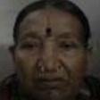

# KYC Face Match — NO MATCH

**Timestamp:** 2026-04-09 10:58:53  
**Aadhaar:** FILES\AADHAR\AADHAR09.pdf  
**Selfie:** FILES\SELFIE\USER_09.jpg  

## Result

| Metric | Value |
|--------|-------|
| **Result** | NO MATCH |
| **Cosine Score** | 0.0519 |
| **Confidence** | 5.2% |
| **Aadhaar Quality** | 1.00 |
| **Selfie Quality** | 0.40 |
| **L2 Distance** | 1.3771 (score: 0.1267) |
| **SSIM** | 0.2482 |
| **Landmark Score** | 0.5530 |
| **Pose Diff** | 12.9 deg |
| **Fused Score** | 0.2043 |
| **Aadhaar** | M, age 31 |
| **Selfie** | M, age 79 |
| **Age Gap** | 48 years |

## Decision Trace
```
  1. Enhancement: Skipped — both images above quality threshold (Aadhaar=1.00, Selfie=0.40, threshold=0.4)
  2. Cosine similarity: 0.0519 → NO MATCH zone (< 0.4 uncertain threshold)
  2b. Age-gap relaxation: 48yr gap → threshold relaxed by 0.100 (effective: match=0.500, uncertain=0.300)
  3. Quality flag: OK (both images above 0.4 threshold)
  4. VLM guard: Not needed — score below uncertain zone (definite no-match)
  5. Final decision: NO MATCH at 5.2% confidence
     Reason: Score below 0.4 — definite no-match, VLM not needed
```

## Face Crops
| Aadhaar | Selfie |
|---------|--------|
|  |  |

## Timings (1076ms total)
| Stage | Time |
|-------|------|
| load_ms | 42ms |
| enhancement_ms | 41ms |
| clahe_ms | 12ms |
| face_processing_ms | 0ms |
| dual_path_ms | 490ms |
| similarity_ms | 492ms |
| **TOTAL** | **1076ms** |
